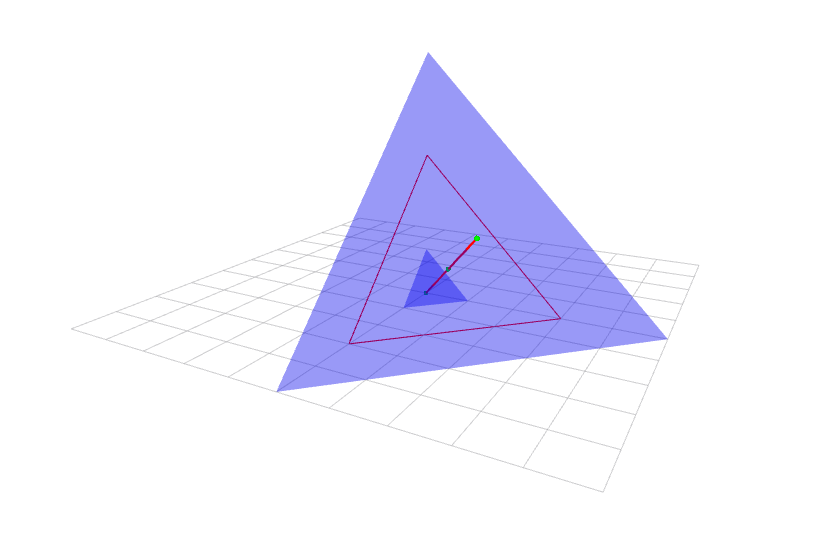

# ros_visualizer

A simple&amp;light ros visualizer for RViz.



## Getting Started

### Demo

1.Clone and build the package

```bash
mkdir -p <YOUR_ROS_WS>/src
cd <YOUR_ROS_WS>/src
git clone https://github.com/MasterYip/ros_visualizer
cd <YOUR_ROS_WS>
catkin_make
```

2.Run the demo

```bash
source devel/setup.bash
roslaunch ros_visualizer test_node.launch
```

### Color Themes

Load different color themes by changing the config file in the launch file.

```xml
<node pkg="ros_visualizer" type="ros_visualizer_test_node" name="ros_visualizer_test_node" output="screen">
    <rosparam command="load" file="$(find ros_visualizer)/config/config_theme_default.yaml"/>
    <!-- <rosparam command="load" file="$(find ros_visualizer)/config/config_theme_blue.yaml"/> -->
</node>
```
